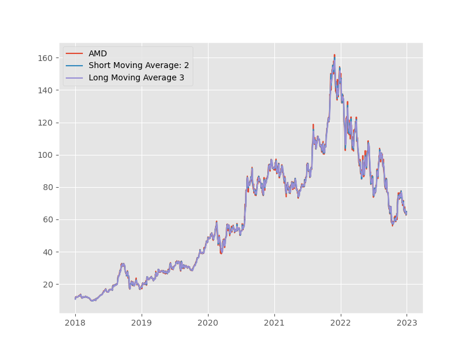
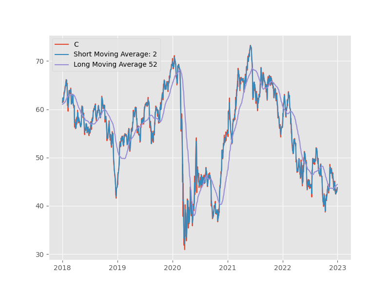
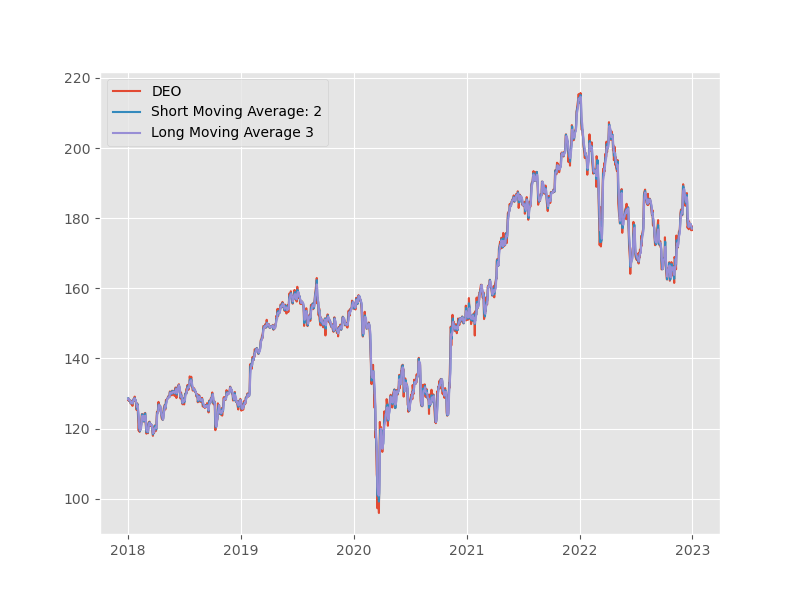

# Automated Trading Program

## About

This project was developed as part of the CUS690 - Applied Analytics Project. The primary objective was to create an automated trading system using the `pandas_datareader` API to determine optimal `short_moving_average` and `long_moving_average` parameters for a selected portfolio of stock tickers. The implementation follows a structured approach with a focus on two main classes: `StockTrader` for handling individual stock data and `PortfolioTrader` for managing multiple stock instances within a portfolio.

The core functionality of the `PortfolioTrader` class involves conducting a grid search for each stock in the portfolio. This search encompasses various combinations of `short_moving_average` and `long_moving_average` values within user-defined ranges. The goal is to identify parameter configurations that yield the highest returns by the end of a specified trading period.

The trading strategy employed is as follows:

- **Sell**: When the `short_moving_average` crosses below the `long_moving_average`
- **Buy**: When the `short_moving_average` crosses above the `long_moving_average` (after selling)
- **Buy More**: When the `short_moving_average` remains consistently above the `long_moving_average`

## Examples and Results

### Example Stock Plots

Some plots showcasing example stocks along with their corresponding long/short moving averages:

| AMD | C | DEO |
|-----|-----|-----|
|  |  |  |

Explore more examples within the `./examples/` directory.

### Trading Results and Analysis

The program's trading strategy hinges on the principle of optimizing parameter values to maximize returns. It evaluates performance using both logarithmic and arithmetic returns.

Logarithmic returns (log-returns) are calculated as:

$$
\text{Log-Return} = \log\left(\frac{\text{End Price}}{\text{Start Price}}\right)
$$

Arithmetic returns are calculated as:

$$
\text{Arithmetic Return} = \frac{\text{End Price} - \text{Start Price}}{\text{Start Price}}
$$


#### Example Trading Results

The included CSV files, `./examples/shorter_results.csv` and `./examples/longer_results.csv`, provide the trading outcomes for various stocks:

- 'Ticker': Stock ticker symbol
- 'Start Price': Initial stock price on the starting date
- 'Start': Start date of trading
- 'End': End date of trading
- 'Short': Optimal short moving average
- 'Long': Optimal long moving average
- 'Baseline': Performance of never selling
- 'Managed': Performance with trading strategy
- '% Difference': Percentage difference between managed and baseline
- '$ Profit': Profit achieved through the trading strategy (('Managed' + 1) * 'Start Price')

The stdout `.log` files document the console output from the latest program runs.


## Requirements

The required packages are:
- pandas
- numpy
- pandas_datareader
- matplotlib
- yfinance (for pdr_override)
- pyyaml

One optional package (for improved speed) is:
- multiprocessing

## Usage

1. Clone this repo
```git clone https://github.com/petertadrous/automated-trading.git```
2. Install the required packages
```pip install -U -r requirements.txt```
3. Optionally install additional package
```pip install -U -r optional-requirements.txt```
4. Modify the parameters `./config/config.yaml`
5. Run the main script
```python main.py```

## License

MIT License

Copyright (c) 2021 petertadrous

## Contact

Peter Tadrous - petertadrous@gmail.com  
Project Link: https://github.com/petertadrous/automated-trading
